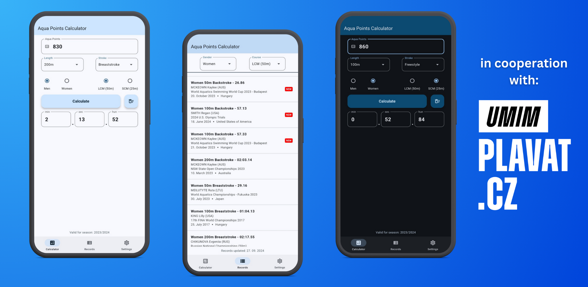

# Aqua Points Calculator
This app allows you to calculate **Aqua Points** from time and vice versa. If you're not familiar with Aqua Points please read following lines.

## Aqua points
The **World Aquatics Points Table** allows comparisons of results among different events. The World Aquatics Point Scoring assigns point values to swimming performances, more points for world class performances typically 1000 or more and fewer points for slower performances.

The **base times are define for all common individual events and relays**, separated for men / women and long course / short course.

The base times are **defined every year**, based on the latest World Record that was approved by World Aquatics. For short course (SCM) the base times are defined with the cut of date of August 31st. For long course (LCM) the base times are defined at the end of the year (December 31st). 

The base times are published on the [World Aquatics website](https://www.worldaquatics.com/swimming/points) within one month after the end of the relevant period.

### Math Formula
The points are calculated using a cubic curve. With the **swim time (T)** and the **base time (B)** in seconds the **points (P)** are calculated with the following formula:

$$ P = 1000 * ( B / T )^3 $$

## Where to try or use the app?
If you prefer web version visit this domain [finapoints.com](https://finapoints.com/). Or if you have Android device you can download the app from the realese tab.

## How the app looks like?

  

