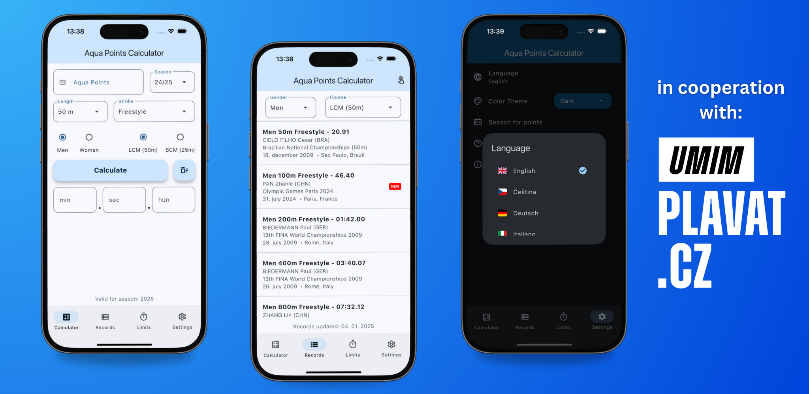

# Aqua Points Calculator
This app allows you to calculate **Aqua Points** from time and vice versa. If you're not familiar with Aqua Points please read following lines.

>[!note]
> From may 2025 I'm trying to use the [gitmoji 😜😍](https://gitmoji.dev) package for better orientation in commits history.

## Aqua points
The **World Aquatics Points Table** allows comparisons of results among different events. The World Aquatics Point Scoring assigns point values to swimming performances, more points for world class performances typically 1000 or more and fewer points for slower performances.

The **base times are define for all common individual events and relays**, separated for men / women and long course / short course.

The base times are **defined every year**, based on the latest World Record that was approved by World Aquatics. For short course (SCM) the base times are defined with the cut of date of August 31st. For long course (LCM) the base times are defined at the end of the year (December 31st). 

The base times are published on the [World Aquatics website](https://www.worldaquatics.com/swimming/points) within one month after the end of the relevant period.

### Math Formula
The points are calculated using a cubic curve. With the *swim time* ($T$) and the *base time* ($B$) in seconds the *points* ($P$) are calculated with the following formula:

$$ P = 1000 * ( B / T )^3 $$

## How can I start using the app?
Visit you favore mobile store and download it for free (we are on both major platforms). Or if you prefer web version, visit the webpage [finapoints.com](https://finapoints.com/).

App is also optimized for larger devices like iPads or desktops.

  

If you download the app from the mobile stores mentioned above and you like it, please leave us a review. If you encounter any problems or have a suggestion for a new feature, feel free to email <a href="mailto:vojtanetrh@gmail.com">email</a> me.

## How the app looks like?

  

## Versions changelog 

#### v1.3.10
- Added polish language.
- Updated point tables.

#### v1.3.8
- Added WR from Singapore World Championships.
- Updated limits fro season 2025/2026 competitions.
- Added "rate the app" button.

#### v1.3.5
- Added Summer McIntosh WR from Canadian Trials.

#### v1.3.4
- Added women long course 100 butterfly and 800 free WR.
- Shortened name displayed on home screens.

#### v1.3.3
- Added men long course 400 free WR.
- Improved translation.
- Small UI changes.

#### v1.3.1
- Added italian language support.
- Added flag icons in language choose dialog.
- Migration onto new localization file system.

#### v1.3.0
- Updated tables for year 2025
- Added option to choose from past season tables
- Added explenation window for limits and season points
- Improved translation

#### v1.2.0
- Added world records from Budapest Worlds
- Added limits for Summer Universiade 2025
- Update "system" color mode to work instantly

#### v1.1.1
- Added new screen with limits for big competitions
- Added ability of app to keep it's state
- Fixed bugs

#### v1.0.6
- Fixed bugs
- Added new WR

#### v1.0.5
- Added new WR from World Cup and USA
- Added splits for all world records

#### v1.0.4
- Fixed bug with no calcualtion in other languages

#### v1.0.3
- Fixed bug of calcualte button

#### v1.0.2
- Added German language
- New "system" option for dark mode
- UI optimalization
- Completed translation

#### v1.0.1
- Fixed bug with hiding keyboard
- Added labels for navigation on iPad

#### v1.0.0
- Initial version

## Help with translation

We are currently supporting 4 languages (Czech, English, German and Italian). If you want to help us "expand" to another countries just help us translate.

Navigate to `lib/l10n` and download the `app_en.arb` file. You will se bunch of pairs of words. On the left side is english name (don't change it) and on the right change the english translation to our picked language. After you translate everything please send it to <a href="mailto:vojtanetrh@gmail.com">my email</a> and I will connect with you.

## Contacts

If you like the app please give a ⭐️ to this repo!
- email: <a href="mailto:vojtanetrh@gmail.com">vojtanetrh@gmail.com</a>
- instagram: <a href="https://www.instagram.com/vojta_netrh/">@vojta_netrh</a>

